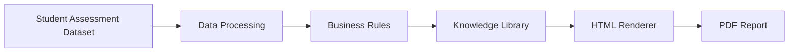

# report-automation-engine
This project is not just about automating reports. It is about understanding what makes a report meaningful, identifying which components can be standardized, and designing a scalable system without losing the value of expert knowledge.

## Why I Started This Project
I started this project after repeatedly encountering manual reporting workflows that required significant effort to maintain consistency, formatting, and narrative quality. Instead of asking how to automate reports, I became more interested in understanding what actually makes a report meaningful.

## Why Reporting Matters

> **A great system can still feel like a poor product if its reports fail to communicate its value.**

Reports are often the final experience users have with a product. Regardless of how sophisticated the underlying technology is, people ultimately judge its value through the reports they read. A meaningful report does more than present information—it explains results, provides context, and supports better decision-making.

## Key Observations
Throughout this project, I observed several recurring patterns that changed the way I think about reporting systems.

---

### 1. Reports are products, not just outputs.

Reports are often considered the final deliverable of a workflow. However, from a user's perspective, the report is often the product itself. Regardless of how sophisticated the underlying system is, the perceived quality of the product is ultimately reflected in the report that users read and interact with.

---

### 2. Narrative reports require more than structured data.

Unlike dashboards or summary reports, narrative reports are expected to explain, interpret, and communicate meaning. They require more than numerical values, they require contextual knowledge that transforms data into understandable insights and recommendations.

---

### 3. Business logic and domain knowledge should be treated as separate components.

One of the most important observations from this project is that reporting systems contain at least two different types of knowledge. Business logic determines *when* and *how* information should be presented, while domain knowledge determines *what* should actually be communicated. Separating these components makes the system significantly easier to maintain and extend.

---

### 4. Standardization does not mean removing expert judgment.

The goal of automation is not to replace expertise, but to reduce repetitive work while preserving expert reasoning where it provides the greatest value. Standardization should improve consistency without making reports feel generic or disconnected from their domain.

---

### 5. Meaningful reporting systems are built layer by layer.

Generating a PDF is only the final step of a reporting workflow. I observed that meaningful reports are not produced by a single process, but by several independent layers working together. Each layer answers a different design question and has a distinct responsibility within the overall reporting architecture.

| Layer | Core Question | Responsibilities |
|---|---|---|
| **Data Processing** | *How should raw data be prepared?* | Validate data Clean & transform Structure datasets |
| **Business Rules** | *When and how should information be shown?* | Conditions Decision logic Prioritization |
| **Knowledge Library** | *How should insights be communicated?* | Narratives Explanations Recommendations |
| **Presentation** | *How should users consume the report?* | Layout Styling HTML / PDF |

Rather than treating reporting as a single automation task, this layered approach separates responsibilities into reusable components that are easier to maintain, extend, and integrate into larger reporting systems.

---

These observations became the foundation for designing the prototype presented in this repository.

## Prototype Overview

To demonstrate these observations, I built a lightweight prototype that transforms structured student assessment data into narrative reports.

Rather than focusing solely on PDF generation, the prototype separates the reporting workflow into reusable layers that mirror the framework introduced above.

The prototype is intentionally simple, using Python, HTML templates, and PDF generation to demonstrate how reporting systems can separate data processing, business logic, knowledge management, and presentation into independent components.

### Outputs

The prototype generates both HTML and PDF reports from structured educational data.

Current capabilities include:

- HTML report generation
- PDF rendering using Playwright
- Dynamic narrative generation
- Configurable business rules
- Batch report generation

### Dataset

This prototype uses the **Student Performance Dataset** from Kaggle as demonstration data.

The dataset contains student demographic information, academic performance, attendance, and behavioral indicators, making it suitable for illustrating how structured educational data can be transformed into narrative reports.

**Source:** [Student Performance Dataset (Kaggle)](https://www.kaggle.com/datasets/nabeelqureshitiii/student-performance-dataset)

## Repository Structure

This repository is organized into two complementary parts:

### 📖 Design Notes
The first part documents the observations, design principles, and architectural decisions behind meaningful reporting systems.

### 💻 Prototype
The second part demonstrates a lightweight implementation that applies those ideas using Python, HTML templates, and PDF generation.

## Future Opportunities
This prototype intentionally focuses on a simple implementation using Excel, Python, HTML, and PDF generation. However, the broader opportunity extends far beyond report automation.

Potential future directions include:
- Database-driven reporting pipelines
- Configurable knowledge libraries
- Content Management System (CMS) integration
- Multi-domain reporting engines
- AI-assisted knowledge authoring and maintenance
- Dynamic report personalization based on business context

Rather than treating reports as static documents, they can evolve into configurable products that continuously combine structured data with expert knowledge.
